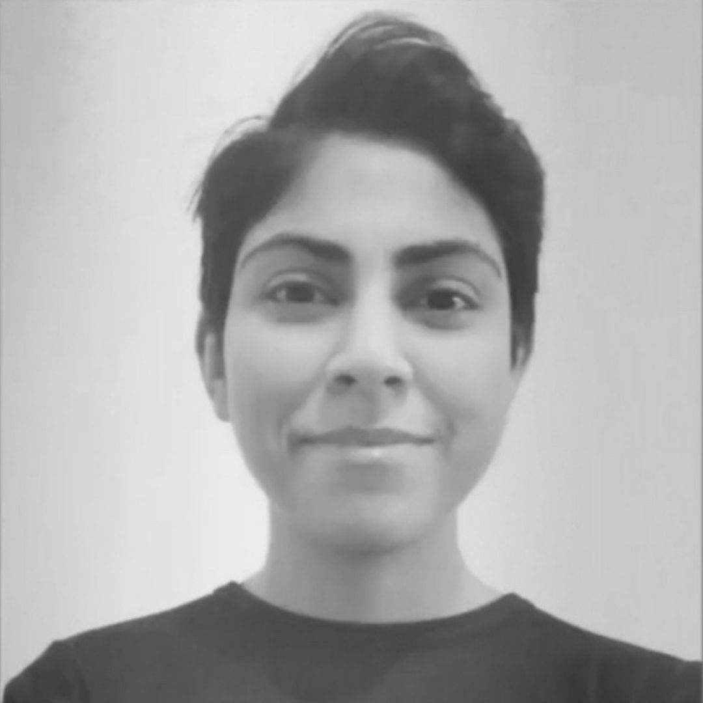
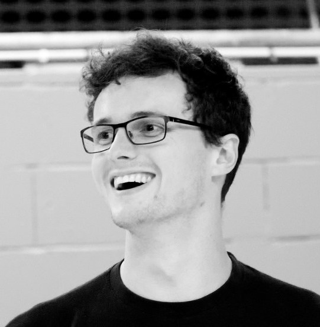

# Our Amazing Team

## Nazeefa Fatima
**Project Lead**  
Sweden – Norway  
Computational biologist. Interests: sequencing technologies (long reads), web development, data management, and genomics infrastructure.

[GitHub](https://github.com/Nazeeefa)

---

## Marcel Tarbier
**Project Member**  
Sweden  
I am a postdoctoral researcher at Karolinska Institute and SciLifeLab in Stockholm. My research focuses on quantitative aspects of single-cell biology, omics technologies and data integration to answer fundamental biological questions with regard to gene regulation and chromatin architecture. I am convinced that Nordic CompBio can address the need for computational biologists to exchange ideas past institutional and country borders.

[Twitter](https://x.com/mtarbier)

